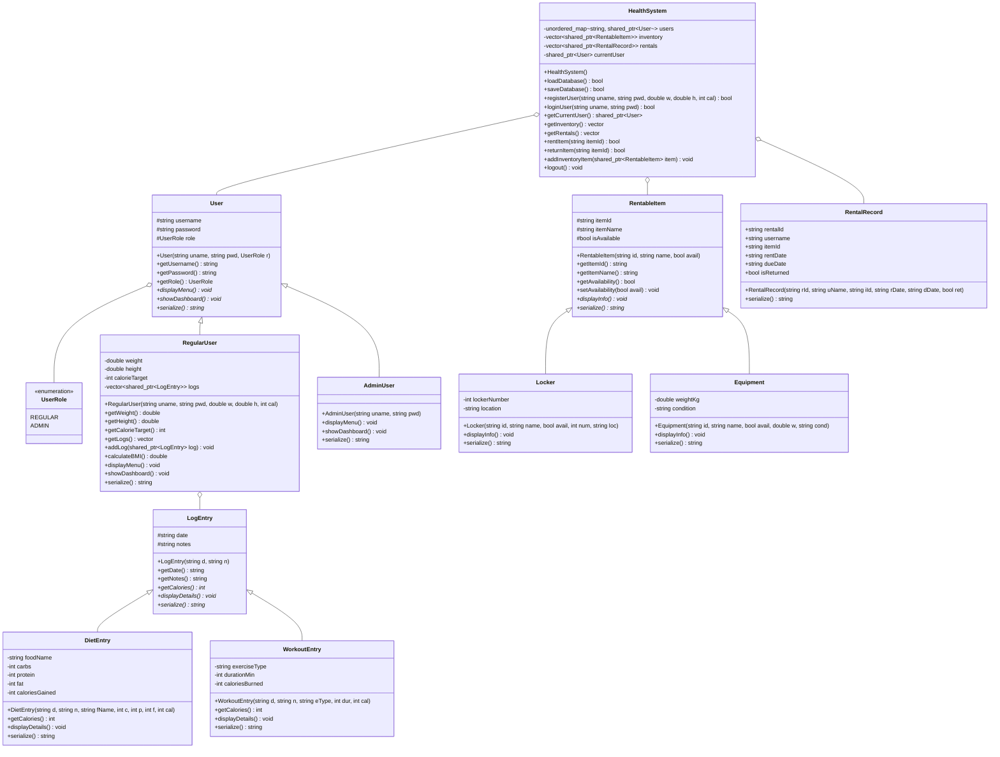

## Context

本專案旨在開發一個結合「個人健身與飲食健康日誌」與「健身房器材/置物櫃租借管理」的 C++17 終端機應用程式。系統需要滿足物件導向設計原則（類別獨立檔案、繼承、多型）、STL 的應用、檔案 I/O 的持久化功能，並透過 CMake 管理多檔案的編譯與安裝流程。

## Goals / Non-Goals

**Goals:**
- 提供一般使用者（Regular User）與管理者（Admin User）雙重角色的操作介面與功能。
- 實作飲食記錄（Diet）與運動記錄（Workout）的健康管理，具備卡路里目標比對功能。
- 實作置物櫃（Locker）與健身器材（Equipment）的租借、歸還與逾期檢查功能。
- 實作資料持久化，將帳戶、器材清單與租借明細安全保存於文字檔案中。
- 每個類別必須擁有獨立的 `.h` 與 `.cpp` 檔案，符合模組化開發。
- 支援 CMake 自動編譯、安裝與發布，並於 Windows 下相容 MSVC 與 MinGW 編譯器。

**Non-Goals:**
- 不實作圖形化介面（GUI），專注於高互動性的 ASCII 終端機（Console）介面。
- 不使用關聯式資料庫（如 MySQL, SQLite 等），純以標準檔案 I/O 與 STL 容器在記憶體中建立資料結構。
- 不實作多執行緒或網路通訊功能（單機版運作即可）。
- 不提供高強度的密碼雜湊與安全加密，僅使用純文字檔儲存密碼以降低學術專案開發門檻。

## Decisions

### 決策 1：多層級繼承與多型 (OO Inheritance & Polymorphism)
- **設計選擇**：
  1. **使用者系統**：基底類別 `User` 宣告純虛擬函式 `displayMenu()` 與 `showDashboard()`。衍生類別 `RegularUser` 與 `AdminUser` 覆寫（Override）這些函式，呈現截然不同的終端介面。
  2. **租借系統**：基底類別 `RentableItem` 宣告 `displayInfo()` 與 `getCalories()`，由衍生類別 `Locker` 與 `Equipment` 繼承並擴充各自專屬的欄位與邏輯。
- **替代方案考慮**：原先考慮以單一類別加上 Flag 來區分角色與物品，但這會導致代碼中充斥大量的 `switch-case` 或 `if-else`，違反物件導向的開放封閉原則（Open-Closed Principle）。

### 決策 2：STL 容器的選擇 (STL Container Strategy)
- **設計選擇**：
  1. 使用 `std::unordered_map<std::string, std::shared_ptr<User>>` 作為活躍使用者的快取，利用 $O(1)$ 的查詢速度快速處理使用者登入與名稱驗證。
  2. 使用 `std::vector<std::shared_ptr<LogEntry>>` 儲存使用者的健康日誌紀錄，並在需要時使用 `std::sort` 依照日期進行排序。
  3. 使用 `std::vector<std::shared_ptr<RentableItem>>` 儲存所有可租借項目，方便進行批次遍歷與狀態查詢。
- **替代方案考慮**：曾考慮使用 `std::list`，但大部分場景需要頻繁的隨機存取或排序，因此選擇能提供連續記憶體配置的 `std::vector`。

### 決策 3：文字資料庫設計 (Flat File Database Design)
- **設計選擇**：
  1. 使用 CSV 格式的文字檔案（以逗號或管道符 `|` 分隔）儲存資料。
  2. 使用 `std::stringstream` 逐行解析資料。當使用者登入或變更資料時，於記憶體中更新 vector，並在登出或正常關閉程式時寫入檔案。
- **替代方案考慮**：曾考慮 XML 或 JSON，但這會引入外部第三方 C++ 函式庫（如 nlohmann/json），增加編譯環境安裝的複雜度。使用標準庫進行字串解析最能維持專案的獨立與純粹性。

### 決策 4：CMake 建置系統 (CMake Build Management)
- **設計選擇**：
  - 使用遞迴搜集 `file(GLOB_RECURSE)` 來自動偵測專案目錄下的所有原始碼與標頭檔。
  - 設計 `install` 指令，將編譯出的執行檔與基礎文字資料庫（`users.txt`等）同步複製至 `build/dist/bin`，確保執行檔執行時能直接讀取到預設資料。

## Risks / Trade-offs

- **[風險 1] 明文密碼儲存**
  - **影響**：任何能讀取系統檔案的人都可以看見使用者與管理者的密碼。
  - **緩解措施**：在 `design.md` 與程式註解中說明此為教學原型專案。若未來需要提升安全性，可輕易引入輕量級 MD5/SHA256 標頭檔對密碼進行雜湊儲存。
- **[風險 2] 資料寫入時的損壞 (Data Corruption)**
  - **影響**：程式在寫入 `users.txt` 的中途若異常當機，可能導致整個資料庫損毀。
  - **緩解措施**：寫入時先將資料寫入暫存檔（如 `temp_users.txt`），確認寫入成功後再覆蓋原檔，以確保原子性（Atomicity）。

---

## 📊 類別架構圖 (UML Class Diagram)

本系統結構完全符合「高內聚、低耦合」設計，下圖展示了各個類別模組的關係與繼承階層：

---

## 📝 類別屬性與方法詳細說明書 (Class Specifications)

### 1. 帳戶模組 (Users Module)

#### 1.1 `User` (基底抽象類別)
- **屬性 (Protected)**:
  - `username` (string): 帳號名稱。
  - `password` (string): 帳號密碼。
  - `role` (UserRole): 權限角色 (`REGULAR` 或 `ADMIN`)。
- **建構子**:
  - `User(string uname, string pwd, UserRole r)`: 初始化屬性。
- **成員方法**:
  - `getUsername()` (string): 取得使用者名稱。
  - `getPassword()` (string): 取得密碼。
  - `getRole()` (UserRole): 取得使用者角色類型。
  - `displayMenu()*` (void, 純虛擬): 渲染該角色的終端機操作選單。
  - `showDashboard()*` (void, 純虛擬): 渲染該角色的儀表板數據。
  - `serialize()*` (string, 純虛擬): 回傳序列化文字資料（用於寫入 users.txt）。

#### 1.2 `RegularUser` (一般使用者類別，承襲 User)
- **屬性 (Private)**:
  - `weight` (double): 使用者體重 (kg)。
  - `height` (double): 使用者身高 (cm)。
  - `calorieTarget` (int): 每日目標攝取卡路里。
  - `logs` (vector<shared_ptr<LogEntry>>): 個人健康與飲食歷史日誌。
- **建構子**:
  - `RegularUser(string uname, string pwd, double w, double h, int cal)`: 調用基底 `User` 並初始化體重、身高與卡路里目標。
- **成員方法**:
  - `getWeight()` / `getHeight()` / `getCalorieTarget()`: 取得各數值 Getter。
  - `getLogs()` (vector<shared_ptr<LogEntry>>): 取得歷史日誌列表。
  - `addLog(shared_ptr<LogEntry> log)` (void): 新增一筆健康紀錄（飲食或運動）。
  - `calculateBMI()` (double): 計算並回傳使用者的 BMI 數值。
  - `displayMenu() override` (void): 顯示一般使用者選單。
  - `showDashboard() override` (void): 顯示今日卡路里進度條（包含攝取、消耗、剩餘預算）。
  - `serialize() override` (string): 實作一般使用者的 CSV 儲存格式串接。

#### 1.3 `AdminUser` (系統管理員類別，承襲 User)
- **建構子**:
  - `AdminUser(string uname, string pwd)`: 調用基底 `User` 初始化為 `ADMIN` 角色。
- **成員方法**:
  - `displayMenu() override` (void): 顯示管理員專屬選單（帳號維護、器材租借管理、庫存管理）。
  - `showDashboard() override` (void): 顯示系統當前總體營運指標統計。
  - `serialize() override` (string): 實作管理員的 CSV 儲存格式串接。

---

### 2. 日誌紀錄模組 (Logs Module)

#### 2.1 `LogEntry` (健康日誌基底抽象類別)
- **屬性 (Protected)**:
  - `date` (string): 紀錄日期 (格式 YYYY-MM-DD)。
  - `notes` (string): 備註。
- **建構子**:
  - `LogEntry(string d, string n)`: 初始化日期與備註。
- **成員方法**:
  - `getDate()` / `getNotes()`: 基礎 Getter。
  - `getCalories()*` (int, 純虛擬): 回傳該日誌項目的卡路里影響力（飲食為正值，運動為負值）。
  - `displayDetails()*` (void, 純虛擬): 以排版文字顯示此紀錄的細節。
  - `serialize()*` (string, 純虛擬): 序列化此筆日誌紀錄，便於持久化寫入個別檔案。

#### 2.2 `DietEntry` (飲食日誌類別，承襲 LogEntry)
- **屬性 (Private)**:
  - `foodName` (string): 食物名稱。
  - `carbs` (int): 碳水化合物含量 (g)。
  - `protein` (int): 蛋白質含量 (g)。
  - `fat` (int): 脂肪含量 (g)。
  - `caloriesGained` (int): 攝取的卡路里量。
- **建構子**:
  - `DietEntry(string d, string n, string fName, int c, int p, int f, int cal)`: 調用基底並初始化營養素。
- **成員方法**:
  - `getCalories() override` (int): 直接回傳正值的 `caloriesGained`。
  - `displayDetails() override` (void): 顯示如食物名、三大營養素與熱量等。
  - `serialize() override` (string): 實作飲食日誌的 CSV 序列化。

#### 2.3 `WorkoutEntry` (運動日誌類別，承襲 LogEntry)
- **屬性 (Private)**:
  - `exerciseType` (string): 運動項目類型。
  - `durationMin` (int): 運動持續時間（分鐘）。
  - `caloriesBurned` (int): 消耗的卡路里量。
- **建構子**:
  - `WorkoutEntry(string d, string n, string eType, int dur, int cal)`: 調用基底並初始化運動細節。
- **成員方法**:
  - `getCalories() override` (int): **回傳負值的 `-caloriesBurned`**，使系統加總時可直接相扣。
  - `displayDetails() override` (void): 顯示運動項目、持續時間與燃燒熱量。
  - `serialize() override` (string): 實作運動日誌的 CSV 序列化。

---

### 3. 器材租借與資產模組 (Rentals Module)

#### 3.1 `RentableItem` (可租借資產基底抽象類別)
- **屬性 (Protected)**:
  - `itemId` (string): 器材/置物櫃唯一編號。
  - `itemName` (string): 資產名稱。
  - `isAvailable` (bool): 當前是否可用。
- **建構子**:
  - `RentableItem(string id, string name, bool avail)`: 初始化資產欄位。
- **成員方法**:
  - `getItemId()` / `getItemName()` / `getAvailability()`: 各項數值 Getter。
  - `setAvailability(bool avail)` (void): 更新可租借狀態。
  - `displayInfo()*` (void, 純虛擬): 輸出此資產的規格描述資訊。
  - `serialize()*` (string, 純虛擬): 序列化寫入 `inventory.txt`。

#### 3.2 `Locker` (置物櫃類別，承襲 RentableItem)
- **屬性 (Private)**:
  - `lockerNumber` (int): 置物櫃號。
  - `location` (string): 櫃位區域。
- **建構子**:
  - `Locker(string id, string name, bool avail, int num, string loc)`: 調用基底並指定櫃號與位置。
- **成員方法**:
  - `displayInfo() override` (void): 顯示置物櫃號、所在區域與可用狀態。
  - `serialize() override` (string): 實作置物櫃 CSV 格式轉換。

#### 3.3 `Equipment` (健身器材類別，承襲 RentableItem)
- **屬性 (Private)**:
  - `weightKg` (double): 器材重量（如有）。
  - `condition` (string): 器材損耗狀況（如 Excellent, Wear, Maintenance）。
- **建構子**:
  - `Equipment(string id, string name, bool avail, double w, string cond)`: 調用基底並指定器材屬性。
- **成員方法**:
  - `displayInfo() override` (void): 顯示器材名稱、重量、損耗程度。
  - `serialize() override` (string): 實作健身器材 CSV 格式轉換。

#### 3.4 `RentalRecord` (租借交易紀錄，單純資料結構)
- **屬性 (Public)**:
  - `rentalId` (string): 租借交易流水號。
  - `username` (string): 承租者帳號名稱。
  - `itemId` (string): 承租物品編號。
  - `rentDate` (string): 租借發生日期 (YYYY-MM-DD)。
  - `dueDate` (string): 應歸還日期。
  - `isReturned` (bool): 是否已歸還狀態。
- **建構子**:
  - `RentalRecord(string rId, string uName, string iId, string rDate, string dDate, bool ret)`: 初始化結構。
- **成員方法**:
  - `serialize()` (string): 序列化寫入 `rentals.txt`。

---

### 4. 系統協調調度模組 (System Orchestrator)

#### 4.1 `HealthSystem` (系統中央核心管理類別)
- **屬性 (Private)**:
  - `users` (unordered_map<string, shared_ptr<User>>): 全系統帳號資料庫快取。
  - `inventory` (vector<shared_ptr<RentableItem>>): 全健身房資產名冊。
  - `rentals` (vector<shared_ptr<RentalRecord>>): 系統租借交易歷史檔。
  - `currentUser` (shared_ptr<User>): 當前登入的 Session 使用者。
- **建構子**:
  - `HealthSystem()`: 初始化空容器並自動調用 `loadDatabase()` 載入檔案。
- **成員方法**:
  - `loadDatabase()` (bool): 讀取 `users.txt`, `inventory.txt`, `rentals.txt`，如果不存在則自動建置。
  - `saveDatabase()` (bool): 將記憶體快取完整寫回實體資料庫，實作原子性覆寫以保全數據安全。
  - `registerUser(string uname, string pwd, double w, double h, int cal)` (bool): 新增註冊一個 RegularUser 實體。確認無重複名稱後寫入 Map 並儲存。
  - `loginUser(string uname, string pwd)` (bool): 身分驗證。比對帳號密碼，成功則指定 `currentUser`。
  - `getCurrentUser()` / `getInventory()` / `getRentals()`: 系統 Getter。
  - `rentItem(string itemId)` (bool): 處理當前登入者租借特定器材的狀態轉換與記錄產生。
  - `returnItem(string itemId)` (bool): 處理當前使用者或管理員歸還器材的狀態重置。
  - `addInventoryItem(shared_ptr<RentableItem> item)` (void): 管理者擴充全新資產至 Inventory 列表中。
  - `logout()` (void): 將 `currentUser` 設為 nullptr，並調用 `saveDatabase()`。
